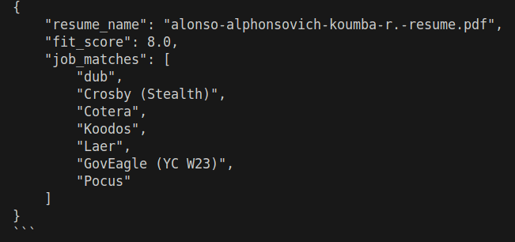
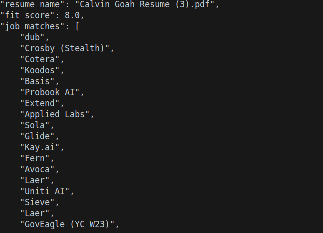
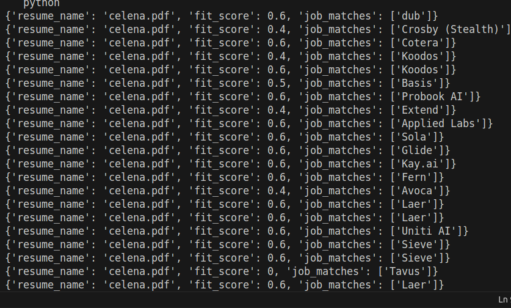
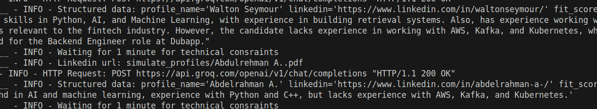

# Job_Profile_matcher
Create a AI base job ranking application. 

## Setup
Clone the repo
```bash
git clone https://github.com/Drwaish/Job_Profile_matcher.git
cd Job_Profile_matcher
```

Now install the requirements
```bash
pip install -r requirements.tx
```

### Create .env
```bash
GROQ_API_KEY=<API KEY>
FIRE_CRAWL_API="<Fir Crawl API>"
SYNAPSE_JOB_PAGE="YOU JOB POSTING URL"
```

### If you want to run task 1
```bash
cd Task1
```

Task 1 is further divided in 2 streams:

First one match resumes with csv:
```bash
python job_file_matcher.py
```
It will match the all esume in **Resume** folder with CSV available in **data** folder and rate te candidate accordingly.

Second approach with 
```bash
python job_matcher_web.py
```
It crawls the Synapse job page, one profile due to token issue. and match with all resumes. 

**First**



**Second**



**Third**




### If you want to run task 2
In this I scrape the data and put it in the form of file, Crawler not working right know.

```bash
cd Task2
```

```bash
python llm_response.py
```
### Response of Task 2:

